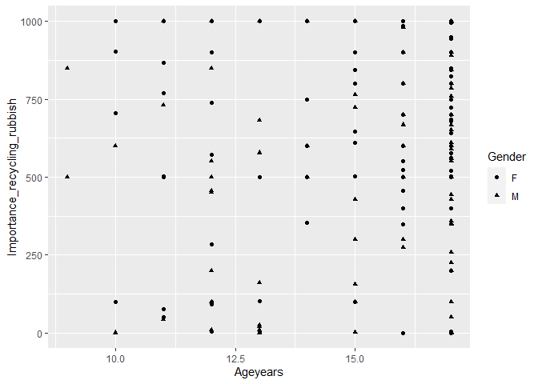

## First 10 rows


```r
library(tidyverse)
```

```
## Warning: package 'tidyverse' was built under R version 3.6.3
```

```
## -- Attaching packages --------------------------------------------------------------------- tidyverse 1.3.0 --
```

```
## v ggplot2 3.3.2     v purrr   0.3.3
## v tibble  2.1.3     v dplyr   0.8.4
## v tidyr   1.0.2     v stringr 1.4.0
## v readr   1.3.1     v forcats 0.4.0
```

```
## Warning: package 'ggplot2' was built under R version 3.6.3
```

```
## -- Conflicts ------------------------------------------------------------------------ tidyverse_conflicts() --
## x dplyr::filter() masks stats::filter()
## x dplyr::lag()    masks stats::lag()
```

```r
Census <- read_csv("CensusAtSchool.csv")
```

```
## Parsed with column specification:
## cols(
##   .default = col_double(),
##   Country = col_character(),
##   Region = col_character(),
##   Gender = col_character(),
##   Handed = col_character(),
##   Travel_to_School = col_character(),
##   Favourite_physical_activity = col_character()
## )
```

```
## See spec(...) for full column specifications.
```

```r
view(Census)
df_inch <- mutate(Census,
                    Height = Height / 2.54, 
                    Foot_Length = Foot_Length / 2.54,
                    Arm_Span = Arm_Span / 2.54)
df_environment <- filter(Census, 
                          Importance_reducing_pollution > 750|
                          Importance_recycling_rubbish > 750|
                          Importance_conserving_water >750|
                          Importance_saving_enery > 750|
                          Importance_owning_computer > 750|
                          Importance_Internet_access >750)
df_environment <- arrange(df_environment, Ageyears)
df_extra <- select(Census, 
                   Country, 
                   Region, 
                   Gender, 
                   Ageyears,
                   Handed,
                   Height,
                   Foot_Length,
                   Arm_Span,
                   Languages_spoken,
                   Travel_to_School,
                   Travel_time_to_School,
                   Reaction_time,
                   Score_in_memory_game,
                   Favourite_physical_activity
                   )
CountCensus <- group_by (Census, Country, Gender)
df_numbers <- summarise(CountCensus, 
                 count= n(),
                 Poll_avg = mean(Importance_reducing_pollution,na.rm = TRUE),
                 Recy_avg = mean(Importance_recycling_rubbish,na.rm = TRUE),
                 Watr_avg = mean(Importance_conserving_water,na.rm = TRUE),
                 Enrg_avg = mean(Importance_saving_enery,na.rm = TRUE),
                 Comp_avg = mean(Importance_owning_computer,na.rm = TRUE),
                 Intr_avg = mean(Importance_Internet_access,na.rm = TRUE))
CountCensus <- group_by (Census, Country, Gender)
df_gender <- summarise(CountCensus, 
                       Poll_avg = mean(Importance_reducing_pollution,na.rm = TRUE),
                       Poll_STD = sd(Importance_reducing_pollution,na.rm = TRUE),
                       Recy_avg = mean(Importance_recycling_rubbish,na.rm = TRUE),
                       Recy_STD = sd(Importance_recycling_rubbish,na.rm = TRUE),
                       Watr_avg = mean(Importance_conserving_water,na.rm = TRUE),
                       Watr_STD = sd(Importance_conserving_water,na.rm = TRUE),
                       Enrg_avg = mean(Importance_saving_enery,na.rm = TRUE),
                       Enrg_STD = sd(Importance_saving_enery,na.rm = TRUE),
                       Comp_avg = mean(Importance_owning_computer,na.rm = TRUE),
                       Comp_STD = sd(Importance_owning_computer,na.rm = TRUE),
                       Intr_avg = mean(Importance_Internet_access,na.rm = TRUE),
                       Intr_STD = sd(Importance_Internet_access,na.rm = TRUE))
CountCensus1 <- group_by (Census, Languages_spoken, Travel_to_School)
df_hand <- summarise(CountCensus1, 
                        Score_Avg = mean(Score_in_memory_game, na.rm = TRUE),
                        Poll_avg = mean(Importance_reducing_pollution,na.rm = TRUE),
                        Recy_avg = mean(Importance_recycling_rubbish,na.rm = TRUE),
                        Watr_avg = mean(Importance_conserving_water,na.rm = TRUE),
                        Enrg_avg = mean(Importance_saving_enery,na.rm = TRUE),
                        Comp_avg = mean(Importance_owning_computer,na.rm = TRUE),
                        Intr_avg = mean(Importance_Internet_access,na.rm = TRUE))
head(df_environment,10)
```

```
## # A tibble: 10 x 20
##    Country Region Gender Ageyears Handed Height Foot_Length Arm_Span
##    <chr>   <chr>  <chr>     <dbl> <chr>   <dbl>       <dbl>    <dbl>
##  1 CA      Ontar~ F             5 R         162          23      158
##  2 CA      Quebec F             6 R         158          23      155
##  3 CA      Quebec M             6 R         147          24      136
##  4 OZ      South~ M             6 R         171          28      172
##  5 OZ      Weste~ M             6 B         140          25      125
##  6 OZ      Victo~ F             7 R         143          23      142
##  7 OZ      Victo~ M             7 R         138          23      135
##  8 OZ      Victo~ F             7 R         140          19      142
##  9 OZ      New S~ F             7 R         154          26      144
## 10 OZ      New S~ M             7 R         147          26      152
## # ... with 12 more variables: Languages_spoken <dbl>, Travel_to_School <chr>,
## #   Travel_time_to_School <dbl>, Reaction_time <dbl>,
## #   Score_in_memory_game <dbl>, Favourite_physical_activity <chr>,
## #   Importance_reducing_pollution <dbl>, Importance_recycling_rubbish <dbl>,
## #   Importance_conserving_water <dbl>, Importance_saving_enery <dbl>,
## #   Importance_owning_computer <dbl>, Importance_Internet_access <dbl>
```

```r
head(df_extra,10)
```

```
## # A tibble: 10 x 14
##    Country Region Gender Ageyears Handed Height Foot_Length Arm_Span
##    <chr>   <chr>  <chr>     <dbl> <chr>   <dbl>       <dbl>    <dbl>
##  1 UK      London F            13 R         164          12      100
##  2 UK      North~ F            11 L         154          23      144
##  3 OZ      Tasma~ M            14 R         156          25      161
##  4 UK      Home ~ M            14 R         152          20      120
##  5 OZ      New S~ F            14 R         170          23      170
##  6 OZ      Weste~ F            12 R         144          24      150
##  7 NZ      Auckl~ F             9 B         126          15      100
##  8 USA     WI     F            12 L         158          24      158
##  9 OZ      New S~ F            11 R         153          24      157
## 10 USA     NY     M            11 R         152          10      100
## # ... with 6 more variables: Languages_spoken <dbl>, Travel_to_School <chr>,
## #   Travel_time_to_School <dbl>, Reaction_time <dbl>,
## #   Score_in_memory_game <dbl>, Favourite_physical_activity <chr>
```

```r
head(df_gender,10)
```

```
## # A tibble: 10 x 14
## # Groups:   Country [6]
##    Country Gender Poll_avg Poll_STD Recy_avg Recy_STD Watr_avg Watr_STD Enrg_avg
##    <chr>   <chr>     <dbl>    <dbl>    <dbl>    <dbl>    <dbl>    <dbl>    <dbl>
##  1 "\x01\~ <NA>       NaN      NaN      NaN      NaN      NaN      NaN      NaN 
##  2 "</pre~ <NA>       NaN      NaN      NaN      NaN      NaN      NaN      NaN 
##  3 "CA"    F          698.     282.     652.     288.     676.     280.     699.
##  4 "CA"    M          620.     336.     588.     319.     611.     331.     624.
##  5 "NZ"    F          743.     237.     NaN      NaN      677.     257.     NaN 
##  6 "NZ"    M          691.     282.     NaN      NaN      617.     321.     NaN 
##  7 "OZ"    F          688.     284.     693.     279.     778.     257.     678.
##  8 "OZ"    M          674.     310.     623.     296.     692.     264.     623.
##  9 "UK"    F          642.     283.     637.     282.     601.     275.     617.
## 10 "UK"    M          649.     310.     631.     328.     627.     294.     651.
## # ... with 5 more variables: Enrg_STD <dbl>, Comp_avg <dbl>, Comp_STD <dbl>,
## #   Intr_avg <dbl>, Intr_STD <dbl>
```

```r
head(df_hand,10)
```

```
## # A tibble: 10 x 9
## # Groups:   Languages_spoken [2]
##    Languages_spoken Travel_to_School Score_Avg Poll_avg Recy_avg Watr_avg
##               <dbl> <chr>                <dbl>    <dbl>    <dbl>    <dbl>
##  1                1 Board                 40       754      548.     765 
##  2                1 Bus                   37.9     652.     608.     620.
##  3                1 Car                   39.4     670.     641.     665.
##  4                1 Cycle                 33.4     687.     618.     616.
##  5                1 Other                 28.3     519.     477      835.
##  6                1 Rail                  36.7     848.     563.     909.
##  7                1 SkateBoard...         20       645      675      675 
##  8                1 Walk                  37.0     633.     626.     632.
##  9                1 <NA>                  48         8       10        3 
## 10                2 Board                 54      1000      444     1000 
## # ... with 3 more variables: Enrg_avg <dbl>, Comp_avg <dbl>, Intr_avg <dbl>
```

```r
head(df_inch,10)
```

```
## # A tibble: 10 x 20
##    Country Region Gender Ageyears Handed Height Foot_Length Arm_Span
##    <chr>   <chr>  <chr>     <dbl> <chr>   <dbl>       <dbl>    <dbl>
##  1 UK      London F            13 R        64.6        4.72     39.4
##  2 UK      North~ F            11 L        60.6        9.06     56.7
##  3 OZ      Tasma~ M            14 R        61.4        9.84     63.4
##  4 UK      Home ~ M            14 R        59.8        7.87     47.2
##  5 OZ      New S~ F            14 R        66.9        9.06     66.9
##  6 OZ      Weste~ F            12 R        56.7        9.45     59.1
##  7 NZ      Auckl~ F             9 B        49.6        5.91     39.4
##  8 USA     WI     F            12 L        62.2        9.45     62.2
##  9 OZ      New S~ F            11 R        60.2        9.45     61.8
## 10 USA     NY     M            11 R        59.8        3.94     39.4
## # ... with 12 more variables: Languages_spoken <dbl>, Travel_to_School <chr>,
## #   Travel_time_to_School <dbl>, Reaction_time <dbl>,
## #   Score_in_memory_game <dbl>, Favourite_physical_activity <chr>,
## #   Importance_reducing_pollution <dbl>, Importance_recycling_rubbish <dbl>,
## #   Importance_conserving_water <dbl>, Importance_saving_enery <dbl>,
## #   Importance_owning_computer <dbl>, Importance_Internet_access <dbl>
```

```r
head(df_numbers,10)
```

```
## # A tibble: 10 x 9
## # Groups:   Country [6]
##    Country    Gender count Poll_avg Recy_avg Watr_avg Enrg_avg Comp_avg Intr_avg
##    <chr>      <chr>  <int>    <dbl>    <dbl>    <dbl>    <dbl>    <dbl>    <dbl>
##  1 "\x01\xe6~ <NA>       1     NaN      NaN      NaN      NaN      NaN      NaN 
##  2 "</pre></~ <NA>       1     NaN      NaN      NaN      NaN      NaN      NaN 
##  3 "CA"       F        124     698.     652.     676.     699.     680.     701.
##  4 "CA"       M        120     620.     588.     611.     624.     673.     700.
##  5 "NZ"       F         72     743.     NaN      677.     NaN      NaN      NaN 
##  6 "NZ"       M         47     691.     NaN      617.     NaN      NaN      NaN 
##  7 "OZ"       F        165     688.     693.     778.     678.     524.     591.
##  8 "OZ"       M        138     674.     623.     692.     623.     566.     609.
##  9 "UK"       F         68     642.     637.     601.     617.     614.     658.
## 10 "UK"       M         68     649.     631.     627.     651.     641.     672.
```

## Visualizations

Looking at this plot you can see that the older Americans get the more emphasis they put on Recycling. We need to empasize the importance of recycling to the younger generations.

```r
CensusUSA <- filter(Census, Country == "USA")

ggplot(data = CensusUSA)+
    geom_point(mapping = aes(x = Ageyears, y = Importance_recycling_rubbish, shape = Gender))
```

<!-- -->
