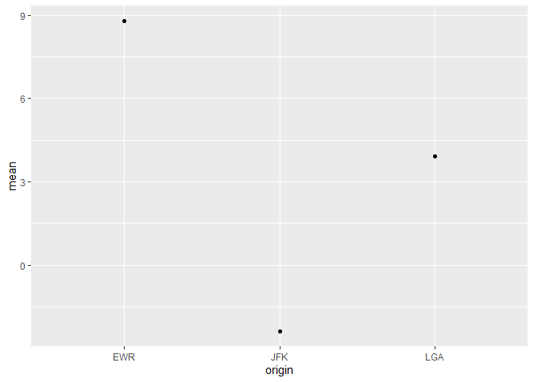
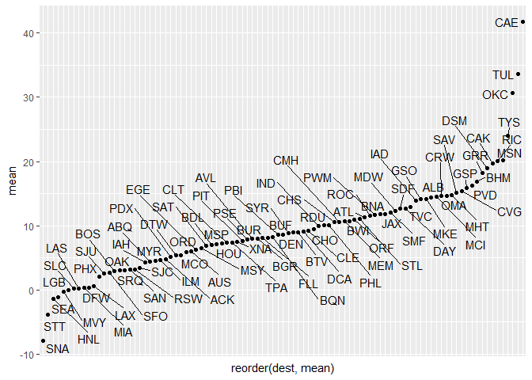

## Introduction

I kept my graph making pretty simple, using means and getting rid of airports with a minimal amount of data.


## Question 2

For question 2, I took the flights dataset and filtered it down to just Delta flights and then grouped it by the origin airport. I looked at the three airports that flew Delta Airlines and found that JFK has lowest mean for arr_delay so it is the best option to minimize chances of a late arrival.


```r
library(tidyverse)
```

```
## Warning: package 'tidyverse' was built under R version 3.6.3
```

```
## -- Attaching packages -------- tidyverse 1.3.0 --
```

```
## v ggplot2 3.3.2     v purrr   0.3.3
## v tibble  2.1.3     v dplyr   0.8.4
## v tidyr   1.0.2     v stringr 1.4.0
## v readr   1.3.1     v forcats 0.4.0
```

```
## Warning: package 'ggplot2' was built under R version 3.6.3
```

```
## -- Conflicts ----------- tidyverse_conflicts() --
## x dplyr::filter() masks stats::filter()
## x dplyr::lag()    masks stats::lag()
```

```r
library(nycflights13)
```

```
## Warning: package 'nycflights13' was built under R version 3.6.3
```

```r
library(ggbeeswarm)
```

```
## Warning: package 'ggbeeswarm' was built under R version 3.6.3
```

```r
Delta <- filter(flights, carrier == "DL")

DeltaGB <- group_by(Delta, origin)
DeltaGB
```

```
## # A tibble: 48,110 x 19
## # Groups:   origin [3]
##     year month   day dep_time sched_dep_time dep_delay arr_time sched_arr_time
##    <int> <int> <int>    <int>          <int>     <dbl>    <int>          <int>
##  1  2013     1     1      554            600        -6      812            837
##  2  2013     1     1      602            610        -8      812            820
##  3  2013     1     1      606            610        -4      837            845
##  4  2013     1     1      615            615         0      833            842
##  5  2013     1     1      653            700        -7      936           1009
##  6  2013     1     1      655            655         0     1021           1030
##  7  2013     1     1      655            700        -5     1037           1045
##  8  2013     1     1      655            700        -5     1002           1020
##  9  2013     1     1      657            700        -3      959           1013
## 10  2013     1     1      658            700        -2      944            939
## # ... with 48,100 more rows, and 11 more variables: arr_delay <dbl>,
## #   carrier <chr>, flight <int>, tailnum <chr>, origin <chr>, dest <chr>,
## #   air_time <dbl>, distance <dbl>, hour <dbl>, minute <dbl>, time_hour <dttm>
```

```r
DeltaGB <- summarise(DeltaGB,
                      mean = mean(arr_delay, na.rm = TRUE),
                      sd = sd(arr_delay, na.rm = TRUE))

DeltaGB
```

```
## # A tibble: 3 x 3
##   origin  mean    sd
##   <chr>  <dbl> <dbl>
## 1 EWR     8.78  52.2
## 2 JFK    -2.38  41.3
## 3 LGA     3.93  45.2
```

```r
ggplot(data = DeltaGB)+
  geom_point(mapping = aes(x = origin, y = mean))
```

<!-- -->

## Question 3

For the third question I grouped by the destination and looked at the mean for arrival delay. I filtered out airports with less than 40 pieces of data because I felt like that's not enough data to be used. I found that the CAE airport had the worst average arrival delay around 42 minutes on average. 


```r
flightsworst <- group_by(flights, dest)

flightsworst <- summarise(flightsworst,
                            mean = mean(arr_delay, na.rm = TRUE),
                            sd = sd(arr_delay, na.rm = TRUE),
                            count = n())

flights2 <- filter(flightsworst, 
                    count >40)

library(ggrepel)
```

```
## Warning: package 'ggrepel' was built under R version 3.6.3
```

```r
ggplot(data = flights2)+
    geom_point(mapping = aes(x = reorder(dest, mean), y = mean))+
    geom_text_repel(aes(x = dest, y = mean, label = dest))
```

<!-- -->
