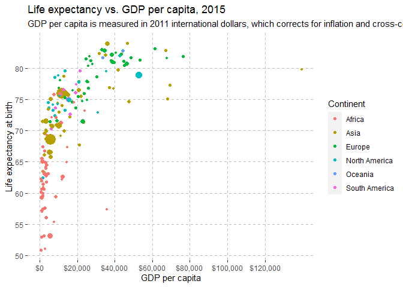
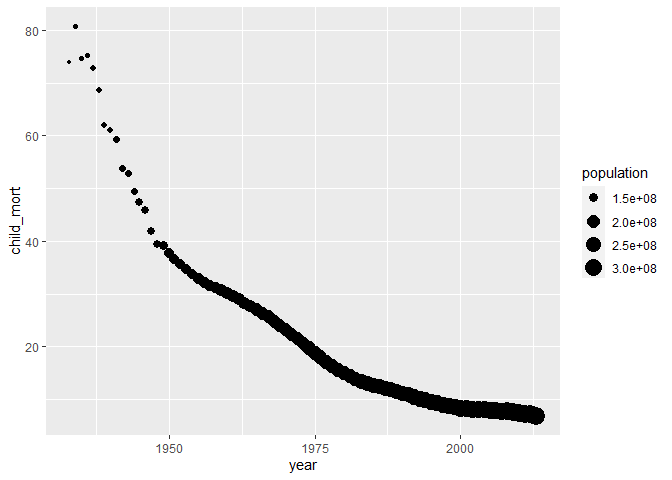
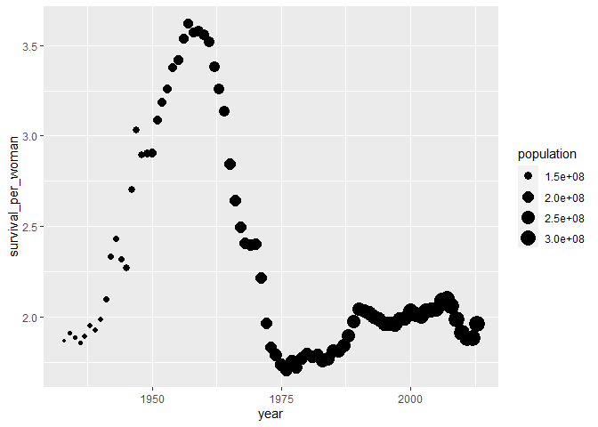
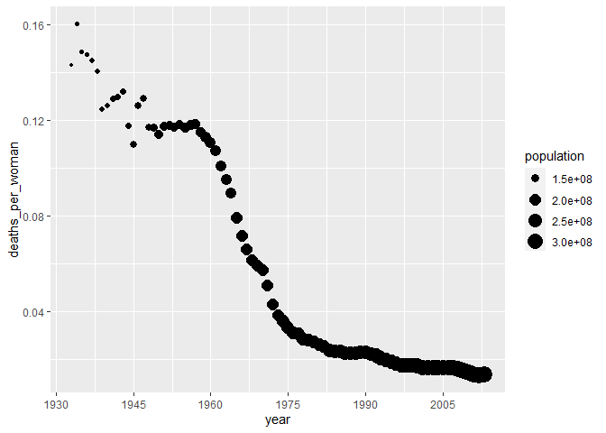
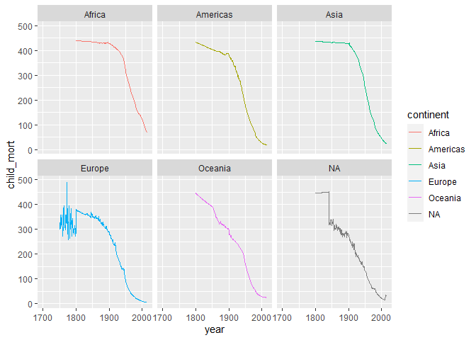

## Plot Replication

I chose a plot that compared the GDP Per Capita to the Life Expectancy at birth. I was able to come up an extremely close parallel.  


```
## Warning: package 'tidyverse' was built under R version 3.6.3
```

```
## -- Attaching packages --------- tidyverse 1.3.0 --
```

```
## v ggplot2 3.3.2     v purrr   0.3.3
## v tibble  2.1.3     v dplyr   0.8.4
## v tidyr   1.0.2     v stringr 1.4.0
## v readr   1.3.1     v forcats 0.4.0
```

```
## Warning: package 'ggplot2' was built under R version 3.6.3
```

```
## -- Conflicts ------------ tidyverse_conflicts() --
## x dplyr::filter() masks stats::filter()
## x dplyr::lag()    masks stats::lag()
```

```
## Parsed with column specification:
## cols(
##   Entity = col_character(),
##   Code = col_character(),
##   Year = col_double(),
##   `Total population (Gapminder, HYDE & UN)` = col_double(),
##   Continent = col_character(),
##   `Life expectancy` = col_double(),
##   `Real GDP per capita in 2011US$, multiple benchmarks (Maddison Project Database (2018))` = col_double()
## )
```

<!-- -->

## Child Mortality

I was able to come up with simple graphs looking at just the United States. Then I was able to group_by the continents and look at each continent's child_mort over about 300 years.


```
## Warning: package 'devtools' was built under R version 3.6.3
```

```
## Loading required package: usethis
```

```
## Warning: package 'usethis' was built under R version 3.6.3
```

```
## WARNING: Rtools is required to build R packages, but is not currently installed.
## 
## Please download and install Rtools 3.5 from https://cran.r-project.org/bin/windows/Rtools/.
```

```
## Skipping install of 'ourworldindata' from a github remote, the SHA1 (ed2fc17b) has not changed since last install.
##   Use `force = TRUE` to force installation
```

```
## # A tibble: 81 x 10
##     year country continent population child_mort survival_per_wo~
##    <int> <chr>   <chr>          <int>      <dbl>            <dbl>
##  1  1933 United~ Americas   126180000       73.9             1.87
##  2  1934 United~ Americas   126978000       80.7             1.91
##  3  1935 United~ Americas   127859000       74.6             1.89
##  4  1936 United~ Americas   128681000       75.1             1.86
##  5  1937 United~ Americas   129464000       72.7             1.89
##  6  1938 United~ Americas   130476000       68.7             1.95
##  7  1939 United~ Americas   131539000       62.0             1.93
##  8  1940 United~ Americas   132637000       61.0             1.99
##  9  1941 United~ Americas   133922000       59.4             2.10
## 10  1942 United~ Americas   135386000       53.8             2.34
## # ... with 71 more rows, and 4 more variables: deaths_per_woman <dbl>,
## #   poverty <dbl>, education <dbl>, health_exp <dbl>
```

<!-- --><!-- --><!-- -->

```
## Warning: Removed 16 row(s) containing missing values (geom_path).
```

<!-- -->


