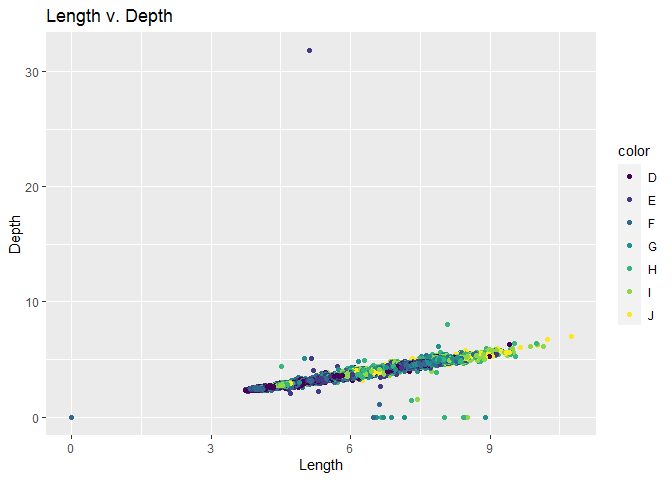
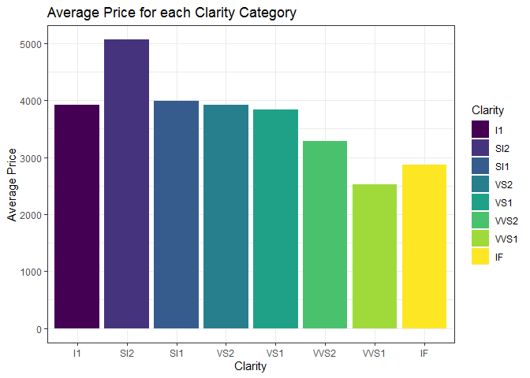
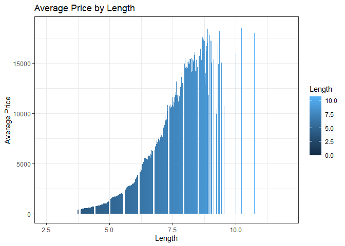
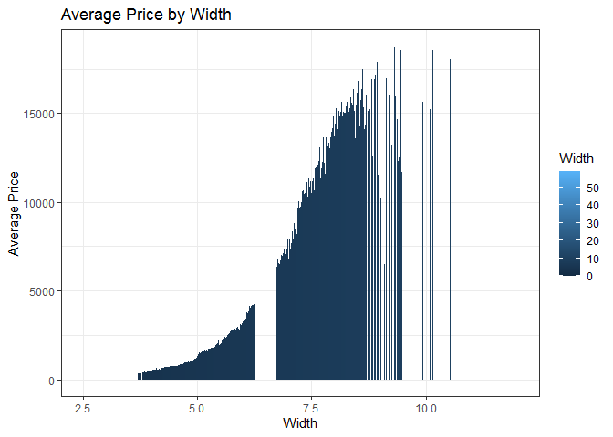
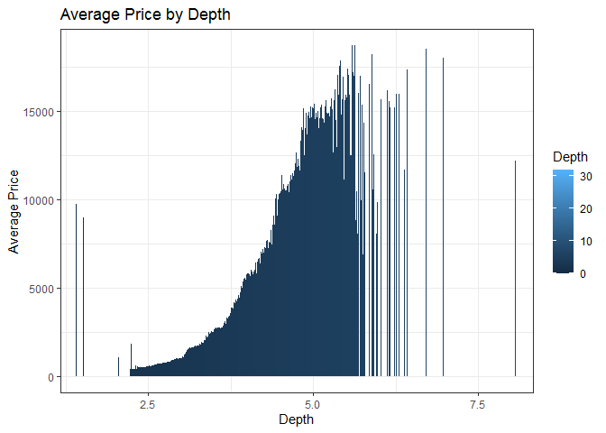
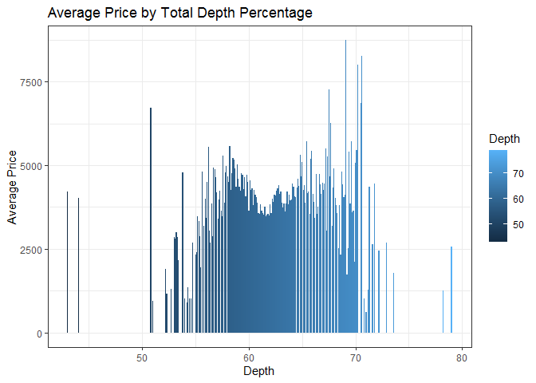
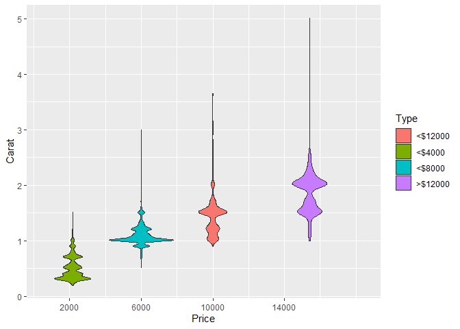
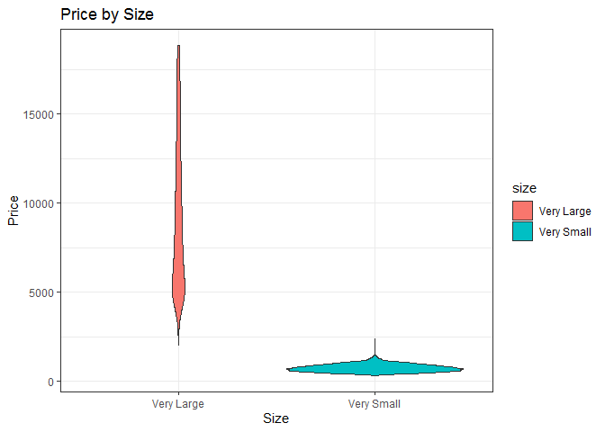
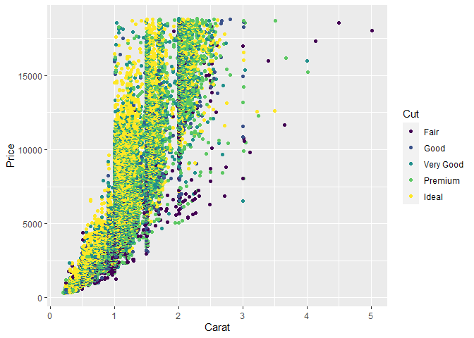

## X, Y, and Z Compared


```r
library(tidyverse)

ggplot(data = diamonds)+
  geom_point(mapping = aes( x = x, y = y, color = color))+
  labs( x = "Length",
        y = "Width",
        title = "Length v. Width")
```

<!-- -->

```r
ggplot(data = diamonds)+
  geom_point(mapping = aes( x = z, y = y, color = color))+
  labs( x = "Depth",
        y = "Width",
        title = "Depth v. Width")
```

<!-- -->

```r
ggplot(data = diamonds)+
  geom_point(mapping = aes( x = x, y = z, color = color))+
  labs( x = "Length",
        y = "Depth",
        title = "Length v. Depth")
```

<!-- -->

Each variable is linear of the other, which is pretty interesting how consistent that is. 


## Price Exploration


```r
dia1 <- group_by(diamonds, clarity) %>%
          summarise(mean = mean(price))

clarity <- ggplot(data = dia1)+
  geom_col(mapping = aes(x = clarity, y = mean, fill = clarity))+
  theme_bw()+
  labs(x = "Clarity",
       y = "Average Price",
       fill = "Clarity",
       title = "Average Price for each Clarity Category")

clarity
```

<!-- -->

```r
dia2 <- group_by(diamonds, carat) %>%
  summarise(mean = mean(price))

carat <- ggplot(data = dia2)+
  geom_col(mapping = aes(x = carat, y = mean, fill = carat))+
  theme_bw()+
  labs(x = "Carat",
       y = "Average Price",
       fill = "Carat",
       title = "Average Price for each Carat Category")


dia3 <- group_by(diamonds, y) %>%
  summarise(mean = mean(price))


width <- ggplot(data = dia3)+
  geom_col(mapping = aes(x = y, y = mean, fill = y))+
  theme_bw()+
  labs(x = "Width",
       y = "Average Price",
       fill = "Width",
       title = "Average Price by Width")+
  coord_cartesian(xlim = c(2.5, 12))+
  scale_x_continuous(breaks = c(2.5, 5.0, 7.5, 10.0))

dia4 <- group_by(diamonds, x) %>%
  summarise(mean = mean(price))

length <- ggplot(data = dia4)+
  geom_col(mapping = aes(x = x, y = mean, fill = x))+
  theme_bw()+
  labs(x = "Length",
       y = "Average Price",
       fill = "Length",
       title = "Average Price by Length")+
  coord_cartesian(xlim = c(2.5, 12))+
  scale_x_continuous(breaks = c(2.5, 5.0, 7.5, 10.0))

dia5 <- group_by(diamonds, z) %>%
  summarise(mean = mean(price))


depth <- ggplot(data = dia5)+
  geom_col(mapping = aes(x = z, y = mean, fill = z))+
  theme_bw()+
  labs(x = "Depth",
       y = "Average Price",
       fill = "Depth",
       title = "Average Price by Depth")+
  coord_cartesian(xlim = c(1.5,8))+
  scale_x_continuous(breaks = c(2.5, 5.0, 7.5))

dia6 <- group_by(diamonds, depth) %>%
  summarise(mean = mean(price))


tdp <- ggplot(data = dia6)+
  geom_col(mapping = aes(x = depth, y = mean, fill = depth))+
  theme_bw()+
  labs(x = "Depth",
       y = "Average Price",
       fill = "Depth",
       title = "Average Price by Total Depth Percentage")

length
```

<!-- -->

```r
width
```

<!-- -->

```r
depth
```

<!-- -->

```r
tdp
```

<!-- -->
I thought it was unusual that the clarity didn't drastically change the price of the diamond.

I looked at a couple different variables and the price reflected those variables and found that price had a steady incline. However when looking at the Depth (Total Depth Percentage) statistic there was no steady incline or decline.


## Carat Partitioned by Price


```r
dia_type <- select(diamonds, carat, price) %>%
    mutate(
      type = case_when(
        price < 4000 ~ "<$4000",
        price < 8000 ~ "<$8000",
        price < 12000 ~ "<$12000",
        price > 12000 ~ ">$12000"
      )
    )


ggplot(data = dia_type)+
  geom_violin(mapping = aes(x = price, y = carat, fill = type))+
  scale_x_continuous(breaks = c(2000, 6000, 10000, 14000))+
  labs(x = "Price",
       y = "Carat",
       fill = "Type")
```

<!-- -->

## Price by Type


```r
dia_typ1 <- diamonds %>%
  select (carat, price) %>%
    mutate(
        size = case_when(
            carat <= 0.4 ~ "Very Small",
            carat < 1.04 ~ "Normal",
            carat >= 1.04 ~ "Very Large"
        )
    ) %>%
  filter(size != "Normal")

ggplot(data = dia_typ1)+
  geom_violin(mapping = aes(x = size, y = price, fill = size))+
  theme_bw()+
  labs(x = "Size",
       y = "Price",
       title = "Price by Size")
```

<!-- -->


## Combined Distribution of Cut, Carat, and Price


```r
ggplot(data = diamonds)+
  geom_point(mapping = aes(x = carat, y = price, color = cut))+
  labs(x = "Carat",
       y = "Price",
       color = "Cut")
```

<!-- -->


