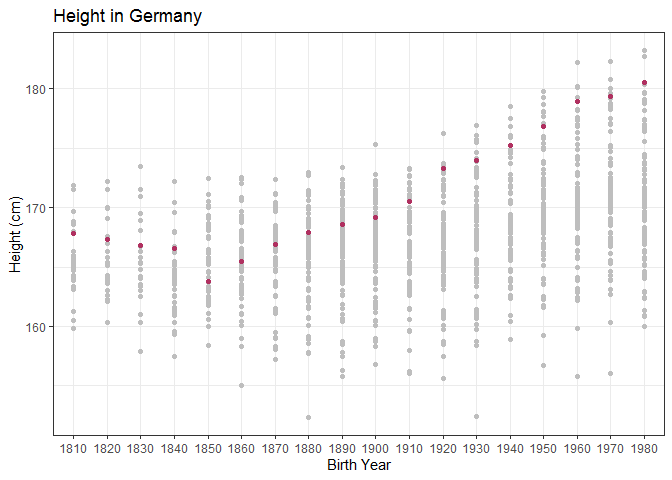
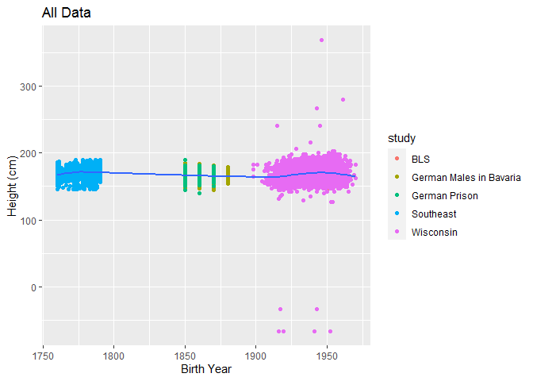
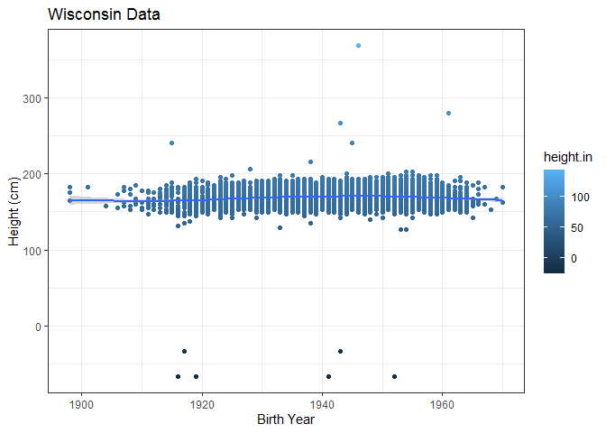

## Loading Data In


```r
# Case Study 7

library(tidyverse)
library(haven)
library(readr)
library(downloader)
library(readxl)
library(foreign)

Tubheight <- tempfile()
download("https://github.com/WJC-Data-Science/DTS350/raw/master/Height.xlsx",
         Tubheight, mode = "wb")
Tubheight <- read_xlsx(Tubheight, skip = 2, col_names = TRUE)
Tubheight
```

```
## # A tibble: 306 x 203
##     Code `Continent, Reg~ `1800` `1801` `1802` `1803` `1804` `1805` `1806`
##    <dbl> <chr>            <lgl>  <lgl>  <lgl>  <lgl>  <lgl>  <lgl>  <lgl> 
##  1   150 Europe           NA     NA     NA     NA     NA     NA     NA    
##  2   155 Western Europe   NA     NA     NA     NA     NA     NA     NA    
##  3    40 Austria          NA     NA     NA     NA     NA     NA     NA    
##  4    56 Belgium          NA     NA     NA     NA     NA     NA     NA    
##  5   280 Federal Republi~ NA     NA     NA     NA     NA     NA     NA    
##  6   250 France           NA     NA     NA     NA     NA     NA     NA    
##  7   278 German Democrat~ NA     NA     NA     NA     NA     NA     NA    
##  8   276 Germany          NA     NA     NA     NA     NA     NA     NA    
##  9   438 Liechtenstein    NA     NA     NA     NA     NA     NA     NA    
## 10   442 Luxembourg       NA     NA     NA     NA     NA     NA     NA    
## # ... with 296 more rows, and 194 more variables: `1807` <lgl>, `1808` <lgl>,
## #   `1809` <lgl>, `1810` <dbl>, `1811` <lgl>, `1812` <lgl>, `1813` <lgl>,
## #   `1814` <lgl>, `1815` <lgl>, `1816` <lgl>, `1817` <lgl>, `1818` <lgl>,
## #   `1819` <lgl>, `1820` <dbl>, `1821` <lgl>, `1822` <lgl>, `1823` <lgl>,
## #   `1824` <lgl>, `1825` <lgl>, `1826` <lgl>, `1827` <lgl>, `1828` <lgl>,
## #   `1829` <lgl>, `1830` <dbl>, `1831` <lgl>, `1832` <lgl>, `1833` <lgl>,
## #   `1834` <lgl>, `1835` <lgl>, `1836` <lgl>, `1837` <lgl>, `1838` <lgl>,
## #   `1839` <lgl>, `1840` <dbl>, `1841` <lgl>, `1842` <lgl>, `1843` <lgl>,
## #   `1844` <lgl>, `1845` <lgl>, `1846` <lgl>, `1847` <lgl>, `1848` <lgl>,
## #   `1849` <lgl>, `1850` <dbl>, `1851` <lgl>, `1852` <lgl>, `1853` <lgl>,
## #   `1854` <lgl>, `1855` <lgl>, `1856` <lgl>, `1857` <lgl>, `1858` <lgl>,
## #   `1859` <lgl>, `1860` <dbl>, `1861` <lgl>, `1862` <lgl>, `1863` <lgl>,
## #   `1864` <lgl>, `1865` <lgl>, `1866` <lgl>, `1867` <lgl>, `1868` <lgl>,
## #   `1869` <lgl>, `1870` <dbl>, `1871` <lgl>, `1872` <lgl>, `1873` <lgl>,
## #   `1874` <lgl>, `1875` <lgl>, `1876` <lgl>, `1877` <lgl>, `1878` <lgl>,
## #   `1879` <lgl>, `1880` <dbl>, `1881` <lgl>, `1882` <lgl>, `1883` <lgl>,
## #   `1884` <lgl>, `1885` <lgl>, `1886` <lgl>, `1887` <lgl>, `1888` <lgl>,
## #   `1889` <lgl>, `1890` <dbl>, `1891` <lgl>, `1892` <lgl>, `1893` <lgl>,
## #   `1894` <lgl>, `1895` <lgl>, `1896` <lgl>, `1897` <lgl>, `1898` <lgl>,
## #   `1899` <lgl>, `1900` <dbl>, `1901` <lgl>, `1902` <lgl>, `1903` <lgl>,
## #   `1904` <lgl>, `1905` <lgl>, `1906` <lgl>, ...
```

```r
germanheight <- read_dta("https://github.com/WJC-Data-Science/DTS350/raw/master/germanconscr.dta")
germanheight
```

```
## # A tibble: 1,382 x 5
##    gebger      bdec height   age co   
##    <chr>      <dbl>  <dbl> <dbl> <chr>
##  1 brueckenau  1850   170.    21 de-se
##  2 brueckenau  1850   156.    21 de-se
##  3 brueckenau  1850   172.    21 de-se
##  4 brueckenau  1850   168.    21 de-se
##  5 brueckenau  1850   167.    21 de-se
##  6 brueckenau  1850   160.    21 de-se
##  7 brueckenau  1850   161.    21 de-se
##  8 brueckenau  1850   162.    21 de-se
##  9 brueckenau  1850   162.    21 de-se
## 10 brueckenau  1850   170.    21 de-se
## # ... with 1,372 more rows
```

```r
germanprison <- read_dta("https://github.com/WJC-Data-Science/DTS350/raw/master/germanprison.dta")
germanprison
```

```
## # A tibble: 477 x 4
##      age  bdec co    height
##    <dbl> <dbl> <chr>  <dbl>
##  1    22  1850 de       156
##  2    26  1850 de       168
##  3    26  1850 de       161
##  4    25  1850 de       159
##  5    26  1850 de       175
##  6    24  1850 de       173
##  7    24  1850 de       173
##  8    24  1850 de       172
##  9    24  1850 de       161
## 10    21  1850 de       175
## # ... with 467 more rows
```

```r
heightSE <- tempfile()
download("https://github.com/WJC-Data-Science/DTS350/raw/master/Heights_south-east/B6090.DBF", heightSE, mode = "wb")
heightSE <- read.dbf(heightSE)


heightscsv <- read_csv("https://raw.githubusercontent.com/hadley/r4ds/master/data/heights.csv")
heightscsv
```

```
## # A tibble: 1,192 x 6
##     earn height sex       ed   age race    
##    <dbl>  <dbl> <chr>  <dbl> <dbl> <chr>   
##  1 50000   74.4 male      16    45 white   
##  2 60000   65.5 female    16    58 white   
##  3 30000   63.6 female    16    29 white   
##  4 50000   63.1 female    16    91 other   
##  5 51000   63.4 female    17    39 white   
##  6  9000   64.4 female    15    26 white   
##  7 29000   61.7 female    12    49 white   
##  8 32000   72.7 male      17    46 white   
##  9  2000   72.0 male      15    21 hispanic
## 10 27000   72.2 male      12    26 white   
## # ... with 1,182 more rows
```

```r
heightsav <- tempfile()
download("http://www.ssc.wisc.edu/nsfh/wave3/NSFH3%20Apr%202005%20release/main05022005.sav", heightsav, mode = "wb")
heightsav <- read_sav(heightsav)
heightsav
```

```
## # A tibble: 7,277 x 2,317
##    CASE  TYPE  CASEID CASENUM     DOBM  DOBY    RT1A1    RT1A2    RT1A3    RT1B1
##    <chr> <chr> <chr>    <dbl> <dbl+lb> <dbl> <dbl+lb> <dbl+lb> <dbl+lb> <dbl+lb>
##  1 00008 S     00008S       8 10 [OCT~    15  5       NA       NA        3      
##  2 00058 R     00058R      58  2 [FEB~    40  3        0 [NON~  1        2      
##  3 00058 S     00058S      58  2 [FEB~    40  0 [NON~ NA       NA        0 [NON~
##  4 00079 S     00079S      79 11 [NOV~    12  7       NA       NA        0 [NON~
##  5 00082 S     00082S      82  7 [JUL~    61  4       NA        1        4      
##  6 00120 R     00120R     120 10 [OCT~    54 14        0 [NON~  0 [NON~  7      
##  7 00120 S     00120S     120 11 [NOV~    54  1       10        2        0 [NON~
##  8 00133 R     00133R     133 10 [OCT~    51 18        0 [NON~  3       18      
##  9 00146 R     00146R     146  4 [APR~    52  1        0 [NON~ NA        2      
## 10 00146 S     00146S     146  4 [APR~    51  0 [NON~ 20       NA        0 [NON~
## # ... with 7,267 more rows, and 2,307 more variables: RT1B2 <dbl+lbl>,
## #   RT1B3 <dbl+lbl>, RT1C1 <dbl+lbl>, RT1C2 <dbl+lbl>, RT1C3 <dbl+lbl>,
## #   RT1D1 <dbl+lbl>, RT1D2 <dbl+lbl>, RT1D3 <dbl+lbl>, RT1E1 <dbl+lbl>,
## #   RT1E2 <dbl+lbl>, RT1E3 <dbl+lbl>, RT1F1 <dbl+lbl>, RT1F2 <dbl+lbl>,
## #   RT1F3 <dbl+lbl>, RT1G1 <dbl+lbl>, RT1G2 <dbl+lbl>, RT1G3 <dbl+lbl>,
## #   RT1H1 <dbl+lbl>, RT1H2 <dbl+lbl>, RT1H3 <dbl+lbl>, RT1I1 <dbl+lbl>,
## #   RT1I2 <dbl+lbl>, RT1I3 <dbl+lbl>, RT204 <dbl+lbl>, RE1 <dbl+lbl>,
## #   RE3 <dbl>, RE4 <dbl>, RT205A <dbl+lbl>, RT205B <dbl+lbl>, RT205C <dbl+lbl>,
## #   RT205D <dbl+lbl>, RT205E <dbl+lbl>, RT205F <dbl+lbl>, RT205G <dbl>,
## #   RE5 <dbl+lbl>, RE6 <dbl>, RE7 <dbl>, RE8 <dbl+lbl>, RE10 <dbl>, RE11 <dbl>,
## #   RE12 <dbl+lbl>, RE14 <dbl>, RE15 <dbl>, RE16 <dbl+lbl>, RE19 <dbl+lbl>,
## #   RE22 <dbl+lbl>, RE25 <dbl+lbl>, RE28 <dbl+lbl>, RE31 <dbl+lbl>, RE32 <dbl>,
## #   RE35 <dbl+lbl>, RE36 <chr>, RE37 <dbl+lbl>, RE38 <dbl+lbl>, RE39 <dbl+lbl>,
## #   RE40 <dbl+lbl>, RE41 <dbl>, RE44 <dbl+lbl>, RE45 <dbl+lbl>, RE46 <dbl+lbl>,
## #   RE47 <dbl+lbl>, RE48 <dbl+lbl>, RE51 <dbl+lbl>, RE50 <dbl+lbl>,
## #   RE52 <dbl+lbl>, RE55 <dbl+lbl>, RF1 <dbl+lbl>, RF2 <dbl+lbl>,
## #   RF3 <dbl+lbl>, RF4 <dbl+lbl>, RF5 <dbl+lbl>, RF6 <dbl+lbl>, RF7 <dbl+lbl>,
## #   RF8 <dbl+lbl>, RF9 <dbl+lbl>, RF10 <dbl+lbl>, RF11 <dbl+lbl>,
## #   RF12 <dbl+lbl>, RF13 <dbl+lbl>, RF14 <dbl+lbl>, RF15 <dbl+lbl>,
## #   RF16 <dbl+lbl>, RF17 <dbl+lbl>, RF18 <dbl+lbl>, RF19 <dbl+lbl>,
## #   RF20 <dbl+lbl>, RF21 <dbl+lbl>, RF22 <dbl+lbl>, RF23 <dbl+lbl>,
## #   RF24M <dbl+lbl>, RF24Y <dbl+lbl>, RF24F <dbl>, RF25 <dbl+lbl>,
## #   RF26 <dbl+lbl>, RF27 <dbl+lbl>, RF28 <dbl+lbl>, RF29 <dbl+lbl>,
## #   RF30 <dbl+lbl>, RF31 <dbl+lbl>, RF32 <dbl+lbl>, ...
```

```r
householdsav <- tempfile()
download("http://www.ssc.wisc.edu/nsfh/wave3/NSFH3%20Apr%202005%20release/nsfh3mainroster1-04042005.sav", householdsav, mode = "wb")
householdsav <- read_sav(householdsav)
householdsav
```

```
## # A tibble: 7,277 x 308
##    case  type  CASEID casenum   sex_A    ms_A    sex_B age_B     ms_B    rel_B
##    <chr> <chr> <chr>    <dbl> <dbl+l> <dbl+l> <dbl+lb> <dbl> <dbl+lb> <dbl+lb>
##  1 00008 S     00008S       8 2 [Fem~ 4 [Wid~ NA          NA NA       NA      
##  2 00058 R     00058R      58 2 [Fem~ 1 [Mar~  2 [Fem~    14 NA       18 [OTH~
##  3 00058 S     00058S      58 1 [Mal~ 3 [Div~ NA          NA NA       NA      
##  4 00079 S     00079S      79 2 [Fem~ 4 [Wid~ NA          NA NA       NA      
##  5 00082 S     00082S      82 2 [Fem~ 3 [Div~  2 [Fem~    16 NA        3 [BIO~
##  6 00120 R     00120R     120 2 [Fem~ 1 [Mar~  2 [Fem~    24  5 [Nev~  3 [BIO~
##  7 00120 S     00120S     120 1 [Mal~ 1 [Mar~  2 [Fem~    47  1 [Mar~  1 [HUS~
##  8 00133 R     00133R     133 2 [Fem~ 1 [Mar~  1 [Mal~    49  1 [Mar~  1 [HUS~
##  9 00146 R     00146R     146 2 [Fem~ 1 [Mar~  1 [Mal~    50  1 [Mar~  1 [HUS~
## 10 00146 S     00146S     146 1 [Mal~ 1 [Mar~  2 [Fem~    50  1 [Mar~  1 [HUS~
## # ... with 7,267 more rows, and 298 more variables: mb1_B <dbl+lbl>,
## #   bio1_B <dbl+lbl>, edu1_B <dbl+lbl>, wrk1_B <dbl+lbl>, stu1_B <dbl+lbl>,
## #   typ1_B <dbl+lbl>, inc1_B <dbl+lbl>, chl1_B <dbl+lbl>, cor1_B <dbl+lbl>,
## #   RD2P_B <dbl+lbl>, RD3MP_B <dbl+lbl>, RD3YP_B <dbl+lbl>, RD4P_B <dbl+lbl>,
## #   RD5P_B <dbl+lbl>, RD6MP_B <dbl+lbl>, RD6YP_B <dbl+lbl>, RD7P_B <dbl+lbl>,
## #   RD9MP_B <dbl+lbl>, RD9YP_B <dbl+lbl>, RD10P_B <dbl+lbl>, RD11P_B <dbl+lbl>,
## #   RD12P_B <dbl+lbl>, RD13MP_B <dbl+lbl>, RD13YP_B <dbl+lbl>,
## #   RD14P_B <dbl+lbl>, sex_C <dbl+lbl>, age_C <dbl>, ms_C <dbl+lbl>,
## #   rel_C <dbl+lbl>, mb1_C <dbl+lbl>, bio1_C <dbl+lbl>, edu1_C <dbl+lbl>,
## #   wrk1_C <dbl+lbl>, stu1_C <dbl+lbl>, typ1_C <dbl+lbl>, inc1_C <dbl+lbl>,
## #   chl1_C <dbl+lbl>, cor1_C <dbl+lbl>, RD2P_C <dbl+lbl>, RD3MP_C <dbl+lbl>,
## #   RD3YP_C <dbl+lbl>, RD4P_C <dbl+lbl>, RD5P_C <dbl+lbl>, RD6MP_C <dbl+lbl>,
## #   RD6YP_C <dbl+lbl>, RD7P_C <dbl+lbl>, RD9MP_C <dbl+lbl>, RD9YP_C <dbl+lbl>,
## #   RD10P_C <dbl+lbl>, RD11P_C <dbl+lbl>, RD12P_C <dbl+lbl>,
## #   RD13MP_C <dbl+lbl>, RD13YP_C <dbl+lbl>, RD14P_C <dbl+lbl>, sex_D <dbl+lbl>,
## #   age_D <dbl>, ms_D <dbl+lbl>, rel_D <dbl+lbl>, mb1_D <dbl+lbl>,
## #   bio1_D <dbl+lbl>, edu1_D <dbl+lbl>, wrk1_D <dbl+lbl>, stu1_D <dbl+lbl>,
## #   typ1_D <dbl+lbl>, inc1_D <dbl+lbl>, chl1_D <dbl+lbl>, cor1_D <dbl+lbl>,
## #   RD2P_D <dbl+lbl>, RD3MP_D <dbl+lbl>, RD3YP_D <dbl+lbl>, RD4P_D <dbl+lbl>,
## #   RD5P_D <dbl+lbl>, RD6MP_D <dbl+lbl>, RD6YP_D <dbl+lbl>, RD7P_D <dbl+lbl>,
## #   RD9MP_D <dbl+lbl>, RD9YP_D <dbl+lbl>, RD10P_D <dbl+lbl>, RD11P_D <dbl+lbl>,
## #   RD12P_D <dbl+lbl>, RD13MP_D <dbl+lbl>, RD13YP_D <dbl+lbl>,
## #   RD14P_D <dbl+lbl>, sex_E <dbl+lbl>, age_E <dbl>, ms_E <dbl+lbl>,
## #   rel_E <dbl+lbl>, mb1_E <dbl+lbl>, bio1_E <dbl+lbl>, edu1_E <dbl+lbl>,
## #   wrk1_E <dbl+lbl>, stu1_E <dbl+lbl>, typ1_E <dbl+lbl>, inc1_E <dbl+lbl>,
## #   chl1_E <dbl+lbl>, cor1_E <dbl+lbl>, RD2P_E <dbl+lbl>, RD3MP_E <dbl+lbl>,
## #   RD3YP_E <dbl+lbl>, RD4P_E <dbl+lbl>, ...
```

Tubingen Data


```r
Tubheighty <- Tubheight %>%
  pivot_longer(c(`1800`:`2011`), names_to = "year_decade", values_to = "height.cm") %>%
  na.omit() %>%
  separate(year_decade, into = c("century","decade"), sep = -2, remove = FALSE)%>%
  separate(decade, into = c("decade", "year"), sep = -1, remove = FALSE) %>%
  mutate(height.in = height.cm/2.54) %>%
  rename(country = "Continent, Region, Country") %>%
  select(Code, country, century, decade, year, height.cm, year_decade, height.in)

  
Tubheighty <- Tubheighty[order(Tubheighty$year_decade),]

write.csv(Tubheighty,"Tubheighty.csv")
```

## Cleaning Data Sets


```r
clean_wisc_height <- heightsav %>%
          select(DOBY, RT216F, RT216I)%>%
          mutate(height.in = (RT216F*12)+ RT216I) %>%
          mutate(birth_year = DOBY + 1900) %>%
          select( -DOBY, -RT216F, -RT216I) %>%
          mutate(height.cm = height.in*2.54) %>%
          add_column(study = "Wisconsin") %>%
          select(birth_year,height.cm,height.in,study)
  
  
head(clean_wisc_height)
```

```
## # A tibble: 6 x 4
##   birth_year height.cm height.in study    
##    <dbl+lbl>     <dbl>     <dbl> <chr>    
## 1       1915      241.        95 Wisconsin
## 2       1940      152.        60 Wisconsin
## 3       1940      170.        67 Wisconsin
## 4       1912      165.        65 Wisconsin
## 5       1961      168.        66 Wisconsin
## 6       1954      157.        62 Wisconsin
```

```r
clean_BLS_height <- heightscsv %>%
              select(height) %>%
              add_column(birth_year = 1950) %>%
              add_column(study = "BLS") %>%
              mutate(height.in = height) %>%
              select(-height) %>%
              mutate(height.cm = height.in*2.54)%>%
  select(birth_year,height.cm,height.in,study)

head(clean_BLS_height)              
```

```
## # A tibble: 6 x 4
##   birth_year height.cm height.in study
##        <dbl>     <dbl>     <dbl> <chr>
## 1       1950      189.      74.4 BLS  
## 2       1950      166.      65.5 BLS  
## 3       1950      162.      63.6 BLS  
## 4       1950      160.      63.1 BLS  
## 5       1950      161.      63.4 BLS  
## 6       1950      164.      64.4 BLS
```

```r
clean_SE_height <- heightSE %>%
          select(SJ, CMETER) %>%
          rename(birth_year = "SJ") %>%
          rename(height.cm = "CMETER") %>%
          mutate(height.in = height.cm/2.54)%>%
          add_column(study = "Southeast")%>%
  select(birth_year,height.cm,height.in,study)
  
head(clean_SE_height)
```

```
##   birth_year height.cm height.in     study
## 1       1773    177.55  69.90157 Southeast
## 2       1773    165.39  65.11417 Southeast
## 3       1773    172.68  67.98425 Southeast
## 4       1773    172.68  67.98425 Southeast
## 5       1773    176.33  69.42126 Southeast
## 6       1773    160.52  63.19685 Southeast
```

```r
clean_German_height <- germanheight %>%
        select(bdec, height) %>%
        rename(birth_year = "bdec") %>%
        rename(height.cm = "height") %>%
        mutate(height.in = height.cm/2.54) %>%
        add_column(study = "German Males in Bavaria")%>%
  select(birth_year,height.cm,height.in,study)

head(clean_German_height)
```

```
## # A tibble: 6 x 4
##   birth_year height.cm height.in study                  
##        <dbl>     <dbl>     <dbl> <chr>                  
## 1       1850      170.      66.8 German Males in Bavaria
## 2       1850      156.      61.6 German Males in Bavaria
## 3       1850      172.      67.9 German Males in Bavaria
## 4       1850      168.      66.2 German Males in Bavaria
## 5       1850      167.      65.6 German Males in Bavaria
## 6       1850      160.      63.1 German Males in Bavaria
```

```r
clean_Prison_height <- germanprison %>%
  select(bdec, height) %>%
  rename(birth_year = "bdec") %>%
  rename(height.cm = "height") %>%
  mutate(height.in = height.cm/2.54) %>%
  add_column(study = "German Prison")%>%
  select(birth_year,height.cm,height.in,study)

head(clean_Prison_height)
```

```
## # A tibble: 6 x 4
##   birth_year height.cm height.in study        
##        <dbl>     <dbl>     <dbl> <chr>        
## 1       1850       156      61.4 German Prison
## 2       1850       168      66.1 German Prison
## 3       1850       161      63.4 German Prison
## 4       1850       159      62.6 German Prison
## 5       1850       175      68.9 German Prison
## 6       1850       173      68.1 German Prison
```

```r
#clean_Wisc_household <- householdsav %>%
#  select(doby, RT216F, RT216I)%>%
#  mutate(height.in = (RT216F*12)+ RT216I) %>%
#  mutate(birth_year = doby + 1900) %>%
#  select( -doby, -RT216F, -RT216I) %>%
#  mutate(height.cm = height.in*2.54) %>%
#  add_column(study = "Wisconsin")
 

new_data <- bind_rows(clean_BLS_height,clean_German_height,clean_Prison_height,clean_SE_height,clean_wisc_height)   
new_data    
```

```
## # A tibble: 28,575 x 4
##    birth_year height.cm height.in study
##         <dbl>     <dbl>     <dbl> <chr>
##  1       1950      189.      74.4 BLS  
##  2       1950      166.      65.5 BLS  
##  3       1950      162.      63.6 BLS  
##  4       1950      160.      63.1 BLS  
##  5       1950      161.      63.4 BLS  
##  6       1950      164.      64.4 BLS  
##  7       1950      157.      61.7 BLS  
##  8       1950      185.      72.7 BLS  
##  9       1950      183.      72.0 BLS  
## 10       1950      183.      72.2 BLS  
## # ... with 28,565 more rows
```

```r
write.csv(new_data,"new_data.csv")
```

## Plot


```r
germany <- Tubheighty %>% 
  filter(`country` == "Germany")

ggplot() +
  geom_point(data = Tubheighty, mapping = aes(x = year_decade, y = height.cm), color = 'grey') +
  geom_point(data = germany, mapping = aes(x = year_decade, y = height.cm), color = 'maroon')+
  labs(x = "Birth Year",
       y = "Height (cm)",
       title = "Height in Germany")+
  theme_bw()
```

<!-- -->

```r
ggplot( data = new_data) +
  geom_point(mapping = aes(x = birth_year, y = height.cm, color = study)) +
  geom_smooth(mapping = aes(x = birth_year, y = height.cm))+
  labs(x = "Birth Year",
       y = "Height (cm)",
       title = "All Data")
```

<!-- -->

```r
wisc_data <- new_data %>% 
  filter(study == 'Wisconsin')
ggplot(data = wisc_data) +
  geom_point(mapping = aes(x = birth_year, y = height.cm, color = height.in)) +
  geom_smooth(mapping = aes(x = birth_year, y = height.cm)) +
  theme_bw()+
  labs(x = "Birth Year",
       y = "Height (cm)",
       title = "Wisconsin Data")
```

<!-- -->

 ## Summary
 
 From the Tubingen data you can see there is a slight decline in height from 1810 to 1850, however since then there has been a steady incline to this day. From the all data graph, you can see there isn't much variation throughout history. It generally hovers around 170ish. The Wisconsin data set had the biggest range of data, so I looked at that and, as like the others, there was little to no variation whatsoever. 

