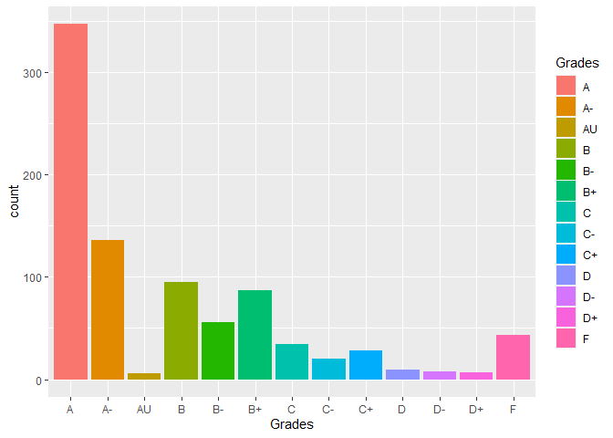

## Graph and 20-row head


```r
library(tidyverse)
library(readxl)
library(downloader)


messy_data1 <- read_xlsx("messy_data.xlsx", skip = 2, col_names = FALSE)


messy_data_del <- subset(messy_data1, select = -c(3,4,6,7,9,10,12,13,15,16) ) 

messy_df <- messy_data_del %>%
  pivot_longer(c('...5','...8','...11','...14','...17'), names_to = "Class",values_to = "Grades") %>%
  na.omit()

ggplot(data = messy_df)+
  geom_bar(mapping = aes(x = Grades, fill = Grades))+
  labs( x = "Grades",
        y = "Count",
        title = "Grades Counted Up")
```

<!-- -->

```r
head(messy_df, 20)
```

```
## # A tibble: 20 x 4
##     ...1 ...2                   Class Grades
##    <dbl> <chr>                  <chr> <chr> 
##  1     1 Computer Science       ...8  A     
##  2     2 Business Analytics     ...11 B+    
##  3     2 Business Analytics     ...14 A     
##  4     3 Electrical Engineering ...5  A     
##  5     4 Computer Science       ...8  B-    
##  6     4 Computer Science       ...11 A-    
##  7     4 Computer Science       ...14 A     
##  8     4 Computer Science       ...17 B     
##  9     5 Applied Mathematics    ...5  A-    
## 10     5 Applied Mathematics    ...8  A     
## 11     6 Psychology             ...11 A-    
## 12     6 Psychology             ...14 A     
## 13     7 Software Engineering   ...8  B-    
## 14     8 Psychology             ...11 B-    
## 15     9 Biochemistry           ...5  A-    
## 16    10 Computer Science       ...8  C     
## 17    11 Data Science           ...5  B     
## 18    11 Data Science           ...11 B-    
## 19    12 Computer Science       ...5  B-    
## 20    13 Computer Science       ...8  A
```

## Description

It appears as though the classes are having a positive affect on the students. From the graph, you can see the majority of the grades are in the "A" bar, and they steadily decrease. There is a slight concerning bump in the "F" bar, but that could probably be explained by people that are thinking about changing majors. 
