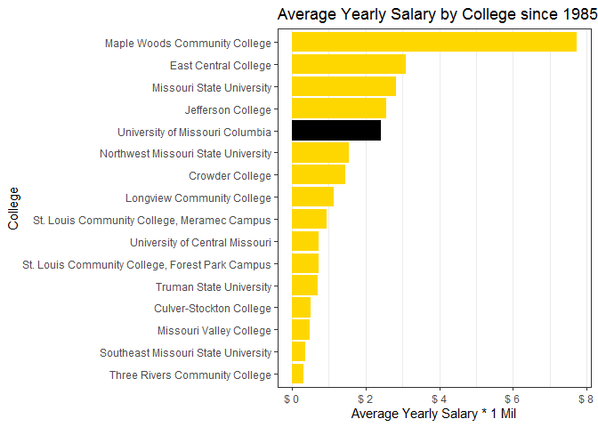
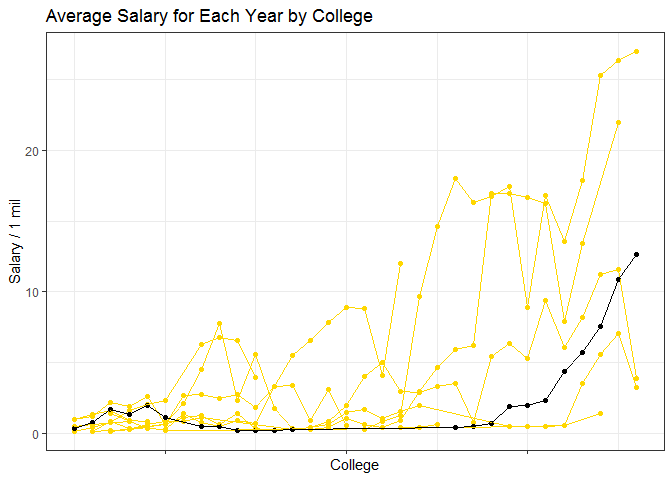
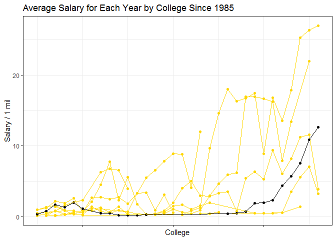
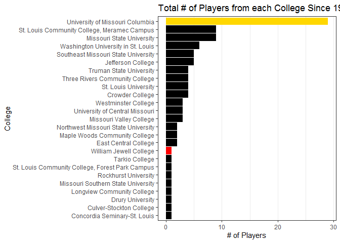
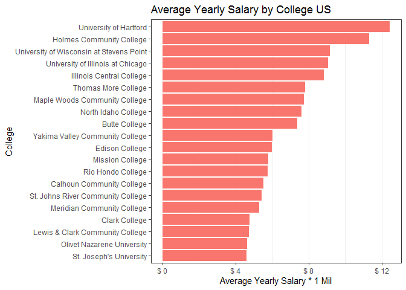
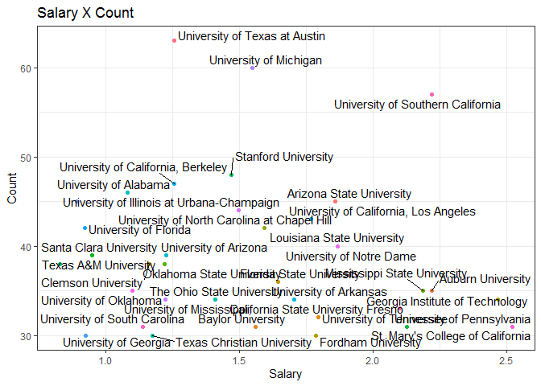
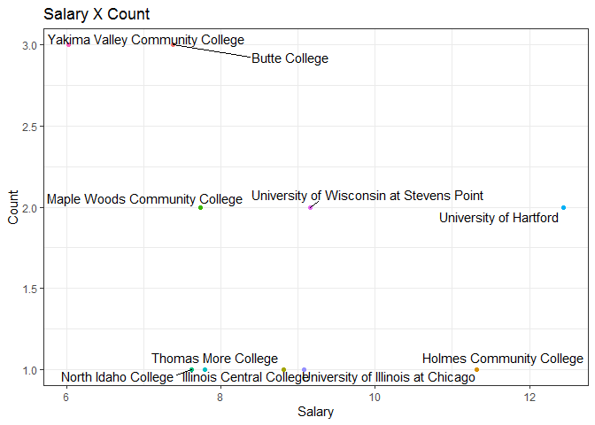
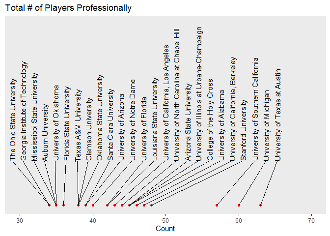
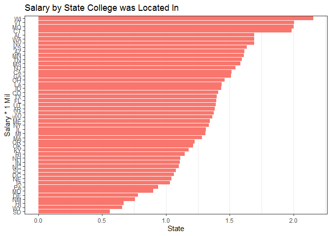

## Average Salary by College


```r
library(tidyverse)
library(Lahman)
library(blscrapeR)

colleges <- Lahman::CollegePlaying
schools <- Lahman::Schools
playerinfo <- Lahman::People
salaries <- Lahman::Salaries

salaries1985 <- filter(salaries, yearID == "1985") %>%
                mutate(salary = salary * 2.42)
salaries1986 <- filter(salaries, yearID == "1986") %>%
  mutate(salary = salary * 2.37)
salaries1987 <- filter(salaries, yearID == "1987") %>%
  mutate(salary = salary * 2.29)
salaries1988 <- filter(salaries, yearID == "1988") %>%
  mutate(salary = salary * 2.2)
salaries1989 <- filter(salaries, yearID == "1989") %>%
  mutate(salary = salary * 2.1)
salaries1990 <- filter(salaries, yearID == "1990") %>%
  mutate(salary = salary * 1.99)
salaries1991 <- filter(salaries, yearID == "1991") %>%
  mutate(salary = salary * 1.91)
salaries1992 <- filter(salaries, yearID == "1992") %>%
  mutate(salary = salary * 1.86)
salaries1993 <- filter(salaries, yearID == "1993") %>%
  mutate(salary = salary * 1.8)
salaries1994 <- filter(salaries, yearID == "1994") %>%
  mutate(salary = salary * 1.76)
salaries1995 <- filter(salaries, yearID == "1995") %>%
  mutate(salary = salary * 1.71)
salaries1996 <- filter(salaries, yearID == "1996") %>%
  mutate(salary = salary * 1.66)
salaries1997 <- filter(salaries, yearID == "1997") %>%
  mutate(salary = salary * 1.62)
salaries1998 <- filter(salaries, yearID == "1998") %>%
  mutate(salary = salary * 1.6)
salaries1999 <- filter(salaries, yearID == "1999") %>%
  mutate(salary = salary * 1.56)
salaries2000 <- filter(salaries, yearID == "2000") %>%
  mutate(salary = salary * 1.51)
salaries2001 <- filter(salaries, yearID == "2001") %>%
  mutate(salary = salary * 1.47)
salaries2002 <- filter(salaries, yearID == "2002") %>%
  mutate(salary = salary * 1.45)
salaries2003 <- filter(salaries, yearID == "2003") %>%
  mutate(salary = salary * 1.41)
salaries2004 <- filter(salaries, yearID == "2004") %>%
  mutate(salary = salary * 1.38)
salaries2005 <- filter(salaries, yearID == "2005") %>%
  mutate(salary = salary * 1.33)
salaries2006 <- filter(salaries, yearID == "2006") %>%
  mutate(salary = salary * 1.29)
salaries2007 <- filter(salaries, yearID == "2007") %>%
  mutate(salary = salary * 1.26)
salaries2008 <- filter(salaries, yearID == "2008") %>%
  mutate(salary = salary * 1.21)
salaries2009 <- filter(salaries, yearID == "2009") %>%
  mutate(salary = salary * 1.21)
salaries2010 <- filter(salaries, yearID == "2010") %>%
  mutate(salary = salary * 1.19)
salaries2011 <- filter(salaries, yearID == "2011") %>%
  mutate(salary = salary * 1.16)
salaries2012 <- filter(salaries, yearID == "2012") %>%
  mutate(salary = salary * 1.13)
salaries2013 <- filter(salaries, yearID == "2013") %>%
  mutate(salary = salary * 1.12)
salaries2014 <- filter(salaries, yearID == "2014") %>%
  mutate(salary = salary * 1.1)
salaries2015 <- filter(salaries, yearID == "2015") %>%
  mutate(salary = salary * 1.1)
salaries2016 <- filter(salaries, yearID == "2016") %>%
  mutate(salary = salary * 1.08)

salary_data <- bind_rows(salaries1985,
                         salaries1986,
                         salaries1987,
                         salaries1988,
                         salaries1989,
                         salaries1990,
                         salaries1991,
                         salaries1992,
                         salaries1993,
                         salaries1994,
                         salaries1995,
                         salaries1996,
                         salaries1997,
                         salaries1998,
                         salaries1999,
                         salaries2000,
                         salaries2001,
                         salaries2002,
                         salaries2003,
                         salaries2004,
                         salaries2005,
                         salaries2006,
                         salaries2007,
                         salaries2008,
                         salaries2009,
                         salaries2010,
                         salaries2011,
                         salaries2012,
                         salaries2013,
                         salaries2014,
                         salaries2015,
                         salaries2016)

MO_Player_college_data <- colleges %>%
                left_join(schools, by = "schoolID") %>%
                left_join(playerinfo, by = "playerID") %>%
                filter(state == "MO") %>%
                left_join(salary_data, by = "playerID") %>%
                select(nameFirst, nameLast, playerID, name_full, schoolID, city, state, salary, yearID.y)%>%
                na.omit()

Single_player_college <- MO_Player_college_data %>%
                  group_by(nameFirst, nameLast, playerID, name_full, schoolID, city, state) %>%
                  summarise(
                              salary =  mean(salary)
                  )

Salary_by_college <- Single_player_college %>%
                        group_by(name_full) %>%
                        summarise(
                              salary = mean(salary)/1000000
                        )

Salary_by_college <- Salary_by_college[order(Salary_by_college$salary),]


ggplot(data = Salary_by_college) +
    geom_col(mapping = aes(x = reorder(name_full,salary), y = salary, fill = name_full))+
    theme_bw() +
    labs(x = "College",
         y = "Average Yearly Salary * 1 Mil",
         title = "Average Yearly Salary by College since 1985")+
    scale_y_continuous(label = function(x){return(paste("$",x))})+
    theme(
      legend.position = "none",
      panel.grid.major.y = element_blank()
    )+
    coord_flip()+
    scale_fill_manual(values = c("gold",
                                 "gold",
                                 "gold",
                                 "gold",
                                 "gold",
                                 "gold",
                                 "gold",
                                 "gold",
                                 "gold",
                                 "gold",
                                 "gold",
                                 "gold",
                                 "gold",
                                 "gold",
                                 "gold",
                                 "black"))
```

<!-- -->

I inflated the salaries using an inflation calculator online and from there, I averaged out everyone's salaries that went to school in MO so that each person has a average per year value. I then divided each salary by 1 million for simplicity purposes. Looking at the graph you can see that Maple Woods is far and away the leader. Knowing that Albert Pujols went there, I assumed that he was an outlier that caused this huge disparity and I was proven right by my next graph and by looking at the top paid players.Pujols appears in the top 25 multiple times and everyone else is from a college with a much bigger player population while Pujols comes from a college with only two players.


```r
topsalaries <- MO_Player_college_data %>%
                select(nameFirst,nameLast,name_full,salary,yearID.y)

topsalaries<- topsalaries[order(-topsalaries$salary),]
head(topsalaries, 25)
```

```
##     nameFirst nameLast                       name_full   salary yearID.y
## 362      Ryan   Howard       Missouri State University 27500000     2014
## 363      Ryan   Howard       Missouri State University 27500000     2015
## 372      Ryan   Howard       Missouri State University 27500000     2014
## 373      Ryan   Howard       Missouri State University 27500000     2015
## 382      Ryan   Howard       Missouri State University 27500000     2014
## 383      Ryan   Howard       Missouri State University 27500000     2015
## 589    Albert   Pujols   Maple Woods Community College 27000000     2016
## 588    Albert   Pujols   Maple Woods Community College 26400000     2015
## 587    Albert   Pujols   Maple Woods Community College 25300000     2014
## 617       Max Scherzer University of Missouri Columbia 23914286     2016
## 625       Max Scherzer University of Missouri Columbia 23914286     2016
## 633       Max Scherzer University of Missouri Columbia 23914286     2016
## 359      Ryan   Howard       Missouri State University 23200000     2011
## 369      Ryan   Howard       Missouri State University 23200000     2011
## 379      Ryan   Howard       Missouri State University 23200000     2011
## 358      Ryan   Howard       Missouri State University 22610000     2010
## 368      Ryan   Howard       Missouri State University 22610000     2010
## 378      Ryan   Howard       Missouri State University 22610000     2010
## 360      Ryan   Howard       Missouri State University 22600000     2012
## 370      Ryan   Howard       Missouri State University 22600000     2012
## 380      Ryan   Howard       Missouri State University 22600000     2012
## 361      Ryan   Howard       Missouri State University 22400000     2013
## 371      Ryan   Howard       Missouri State University 22400000     2013
## 381      Ryan   Howard       Missouri State University 22400000     2013
## 121      Mark  Buehrle               Jefferson College 22000000     2015
```

## # of Players from Each college


```r
ggplot(data = Single_player_college)+
    geom_bar(mapping = aes(x = name_full, fill = name_full), position = 'dodge')+
    labs( x = "College",
          y = "Count",
          title = "# of Players from each College since 1985",
          fill = "College")+
    coord_flip()+
    theme_bw()+
    theme(
        legend.position = "none",
        panel.grid.major.y = element_blank()
    )+
  scale_fill_manual(values = c("gold",
                               "gold",
                               "gold",
                               "gold",
                               "gold",
                               "darkgreen",
                               "gold",
                               "gold",
                               "gold",
                               "gold",
                               "gold",
                               "gold",
                               "gold",
                               "gold",
                               "gold",
                               "black"))
```

<!-- -->


Looking at this graph you can see that the University of Missouri and Missouri State University are far and away leading the total with 9 players each. 


## Salary by Year


```r
salary_by_year <- MO_Player_college_data %>%
  group_by(name_full, yearID.y) %>%
  summarise(
     salary = mean(salary)/1000000
  )

ggplot(data = salary_by_year)+
    geom_point(mapping = aes(x = yearID.y, y = salary, color = name_full)) +
    geom_line(mapping = aes(x = yearID.y, y = salary, color = name_full))+
    labs(x = "College",
         y = "Salary / 1 mil",
         title = "Average Salary for Each Year by College Since 1985")+
    theme_bw()+
  scale_colour_manual(values = c("University of Missouri Columbia" = "black",
                                 "Crowder College" = "gold",
                                 "Culver-Stockton College" = "gold",
                                 "East Central College" = "gold",
                                 "Jefferson College" = "gold",
                                 "Longview Community College" = "gold",
                                 "Maple Woods Community College" = "gold",
                                 "Missouri State University" = "gold",
                                 "Missouri Valley College" = "gold",
                                 "Northwest Missouri State University" = "gold",
                                 "Southeast Missouri State Universtiy" = "gold",
                                 "St. Louis Community College, Forest Park Campus" = "gold",
                                 "St. Louis Community College, Meramec Campus" = "gold",
                                 "Three Rivers Community College" = "gold",
                                 "Truman State University" = "gold",
                                 "University of Central Missouri" = "gold"
                                 ))+
  
  theme(
    axis.text.x = element_blank(),
    legend.position = "none")
```

<!-- -->

Looking at the graph you can see that the University of Missouri Columbia is actually fairly middle of the pack in terms of salary by year. Looking at the next graph, you can see that they have produced the most talent. They seem to have trouble producing the cream of the crop though. 


```r
 MO_Player_college_data_all <- colleges %>%
      left_join(schools, by = "schoolID") %>%
      left_join(playerinfo, by = "playerID") %>%
      filter(state == "MO") %>%
      group_by( name_full, birthYear) %>%
      summarise(
        yob = mean(birthYear)) 
    
    
    college_count <- MO_Player_college_data_all %>%
          count(name_full, sort = TRUE)
    
   
   
    ggplot(data = college_count) +
      geom_col(mapping = aes(x = reorder(name_full,n), y = n, fill = name_full))+
      theme_bw() +
      labs(x = "College",
           y = "# of Players",
           title = "Total # of Players from each College Since 1900")+
      theme(
        legend.position = "none",
        panel.grid.major.y = element_blank()
      )+
      coord_flip()+
      scale_fill_manual(values = c("black",
                                   "black",
                                   "black",
                                   "black",
                                   "black",
                                   "black",
                                   "black",
                                   "black",
                                   "black",
                                   "black",
                                   "black",
                                   "black",
                                   "black",
                                   "black",
                                   "black",
                                   "black",
                                   "black",
                                   "black",
                                   "black",
                                   "black",
                                   "black",
                                   "gold",
                                   "black",
                                   "black",
                                   "red"))
```

<!-- -->


## US Data


```r
    US_Player_college_data <- colleges %>%
      left_join(schools, by = "schoolID") %>%
      left_join(playerinfo, by = "playerID") %>%
      left_join(salary_data, by = "playerID") %>%
      select(nameFirst, nameLast, playerID, name_full, schoolID, city, state, salary, yearID.y)%>%
      na.omit()
    
    
    
    US_Single_player_college <- US_Player_college_data %>%
      group_by(nameFirst, nameLast, playerID, name_full, schoolID, city, state) %>%
      summarise(
        salary =  mean(salary)
      )
    
    
    US_salary_by_college <- US_Single_player_college %>%
      group_by(name_full, schoolID,city,state) %>%
      summarise(
        salary = mean(salary)/1000000
      )
    
    US_salary_by_college <- US_salary_by_college[order(-US_salary_by_college$salary),]
    
    
    
    Top_US_Salaries <- head(US_salary_by_college,20)
    
    
    ggplot(data = Top_US_Salaries) +
      geom_col(mapping = aes(x = reorder(name_full,salary), y = salary, fill = "black"))+
      theme_bw() +
      labs(x = "College",
           y = "Average Yearly Salary * 1 Mil",
           title = "Average Yearly Salary by College US")+
      scale_y_continuous(label = function(x){return(paste("$",x))})+
      theme(
        legend.position = "none",
        panel.grid.major.y = element_blank()
      )+
      coord_flip()
```

<!-- -->

```r
    US_count_data <- colleges %>%
      left_join(schools, by = "schoolID") %>%
      left_join(playerinfo, by = "playerID") %>%
      group_by( name_full, birthYear) %>%
      summarise(
        yob = mean(birthYear)) 
    
    
    US_college_count5 <- US_count_data %>%
      count(name_full, sort = TRUE)
    
    total_US_Data <- US_college_count5 %>%
            left_join(US_salary_by_college, by = "name_full")%>%
            na.omit()
    
  
    total_US_45 <- total_US_Data %>%
                filter(n > 44)
    library(ggrepel)
    
    ggplot( data = total_US_45 ) +
        geom_point(mapping = aes(x = salary, y = n, color = name_full ))+
      geom_text_repel(mapping = aes(x=salary,y=n,label=name_full), force = 1, nudge_y = 1)+
      theme_bw()+
      theme(
            legend.position = "none"
        )+
      labs(x="Salary",
           y="Count",
           title="Salary X Count")
```

<!-- -->

```r
    total_US_6 <- total_US_Data %>%
      filter(salary > 6)
    
    
    ggplot( data = total_US_6 ) +
      geom_point(mapping = aes(x = salary, y = n, color = name_full ))+
      geom_text_repel(mapping = aes(x=salary,y=n,label=name_full), force = 1)+
      theme_bw()+
      theme(
        legend.position = "none"
      )+
      labs(x="Salary",
           y="Count",
           title="Salary X Count")
```

<!-- -->

```r
    US_count_data <- colleges %>%
      left_join(schools, by = "schoolID") %>%
      left_join(playerinfo, by = "playerID") %>%
      group_by( name_full, birthYear) %>%
      summarise(
        yob = mean(birthYear)) 
    
    US_college_count5 <- US_count_data %>%
      count(name_full, sort = TRUE)
    
    count_US_25 <- head( US_college_count5, 25)
    

    ggplot(count_US_25,aes(x = n, y = 1, label = rownames(count_US_25$name_full)))+
      geom_point(color="red")+
      geom_text_repel(
        label = count_US_25$name_full,
        nudge_y = 0.05,
        direction = "x",
        angle = 90,
        vjust = 0,
        segment.size = 0.2
      )+
      xlim(30,70)+
      ylim(1,0.8)+
      theme(axis.line.y = element_blank(),
            axis.ticks.y = element_blank(),
            axis.text.y = element_blank(),
            axis.title.y = element_blank(),
            panel.grid = element_blank())+
      labs(x = "Count",
           title = "Total # of Players Professionally")
```

<!-- -->

```r
    US_salary_by_State <- US_Single_player_college %>%
      group_by(state) %>%
      summarise(
        salary = mean(salary)/1000000
      )
    
    US_salary_by_State <- US_salary_by_State[order(-US_salary_by_State$salary),]

    view(US_salary_by_State)
        
    ggplot(data = US_salary_by_State)+
      geom_col(mapping = aes(x = reorder(state,salary), y = salary, fill = "lightblue"))+
      coord_flip()+
      theme_bw()+
      labs(x = "Salary * 1 Mil",
           y = "State",
           title = "Salary by State College was Located In"
           )+
      theme(
        legend.position = "none",
        panel.grid.major.y = element_blank())
```

<!-- -->
