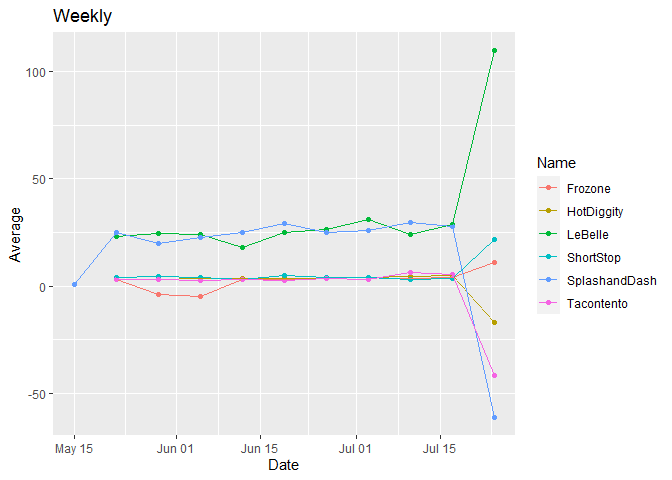
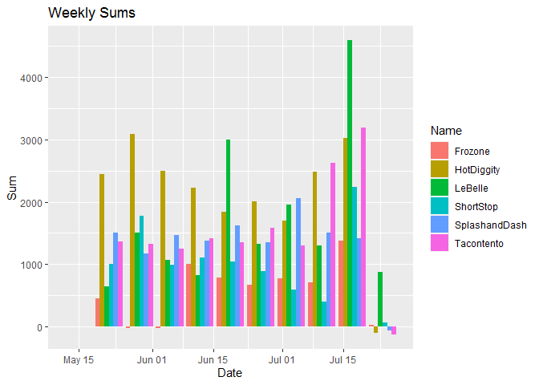
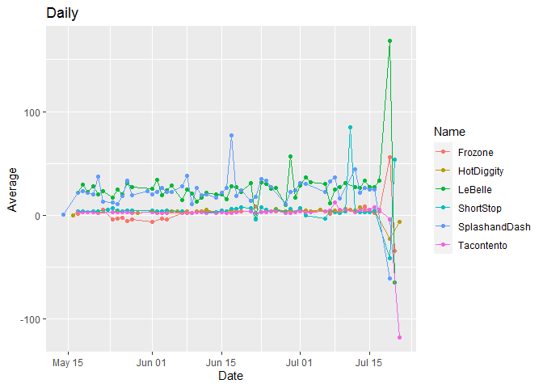
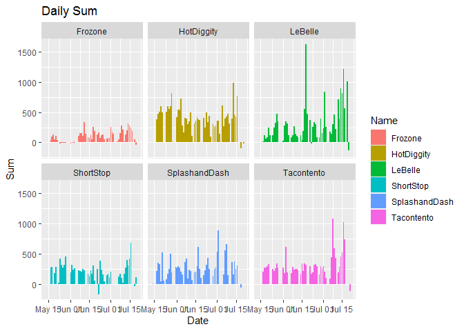
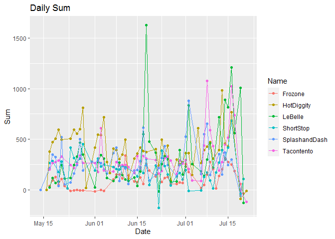
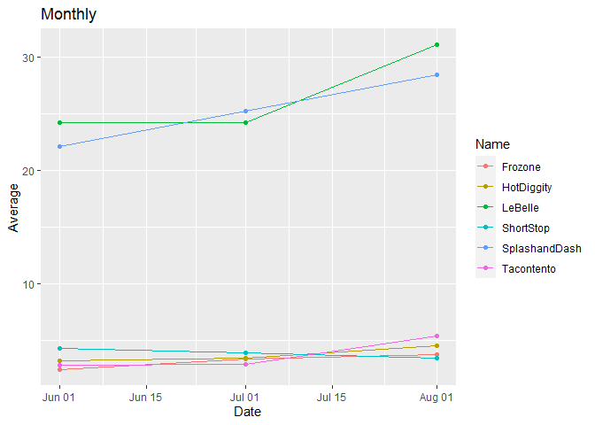
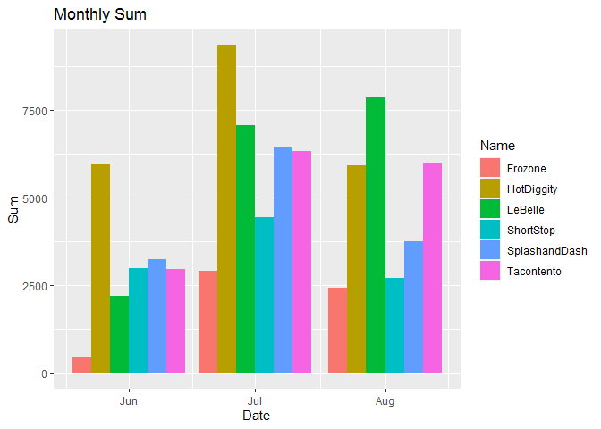

```r
library(tidyverse)
library(lubridate)
library(tidyverse)
library(lubridate)

sales <- read_csv("https://github.com/WJC-Data-Science/DTS350/raw/master/sales.csv")

sales$Time <- force_tz(sales$Time, tzone = "America/Denver", roll = FALSE)

sales$Time <- ceiling_date(sales$Time, unit = "hours", change_on_boundary = NULL, week_start = getOption("lubridate.week.start", 7 ))


sales <- sales %>%
  filter(Name != "Missing") %>%
  filter(Time > "2016-05-12 00:00:00")

salesdatetime <- separate(sales, Time, c("date","time"), sep = " ") 


## weekly
salesweekly <- sales

salesweekly$Time <- ceiling_date(salesweekly$Time,unit = "weeks", change_on_boundary = NULL, week_start = getOption("lubridate.week.start", 7 ))


salesweeklyavg <- salesweekly %>%
  group_by(Name, Type, Time) %>%
  summarise(
      avg = mean(Amount)
  )

salesweeklyavg <- salesweeklyavg %>%
    separate(Time, c("Date", "Time"), sep = " ") %>%
    select(Name, Type, Date, avg)

salesweeklyavg$Date <- as.Date(salesweeklyavg$Date)

ggplot(data = salesweeklyavg) +
  geom_point(mapping = aes(x = Date, y = avg, color = Name))+
  geom_line(mapping = aes(x = Date, y = avg, color = Name))+
  labs(y = "Average",
       title = "Weekly")
```

<!-- -->

```r
## Sales Weekly Sum

salesweeklysum <- salesweekly %>%
  group_by(Name, Type, Time) %>%
  summarise(
    sum = sum(Amount)
  )


salesweeklysum <- salesweeklysum %>%
  separate(Time, c("Date", "Time"), sep = " ") %>%
  select(Name, Type, Date, sum)


salesweeklysum$Date <- as.Date(salesweeklysum$Date)

ggplot(data = salesweeklysum) +
  geom_col(mapping = aes(x = Date, y = sum, fill = Name), position = position_dodge())+
  labs(y = "Sum",
       title = "Monthly")+
  labs(x = "Date",
       y = "Sum",
       title = "Weekly Sums")
```

<!-- -->

```r
## Daily Avg

salesdaily <- sales

salesdaily$Time <- ceiling_date(salesdaily$Time,unit = "days", change_on_boundary = NULL, week_start = getOption("lubridate.week.start", 7 ))

salesdailyavg <- salesdaily%>%
  group_by(Name, Type, Time) %>%
  summarise(
    avg = mean(Amount)
  )

salesdailyavg <- salesdailyavg %>%
  separate(Time, c("Date", "Time"), sep = " ") %>%
  select(Name, Type, Date, avg)


salesdailyavg$Date <- as.Date(salesdailyavg$Date)

ggplot(data = salesdailyavg) +
  geom_point(mapping = aes(x = Date, y = avg, color = Name))+
  geom_line(mapping = aes(x = Date, y = avg, color = Name))+
  labs(y = "Average",
       title = "Daily")
```

<!-- -->

```r
## Daily Sum


salesdailysum <- salesdaily %>%
  group_by(Name, Type, Time) %>%
  summarise(
    sum = sum(Amount)
  )


salesdailysum <- salesdailysum %>%
  separate(Time, c("Date", "Time"), sep = " ") %>%
  select(Name, Type, Date, sum)


salesdailysum$Date <- as.Date(salesdailysum$Date)

ggplot(data = salesdailysum) +
  geom_col(mapping = aes(x = Date, y = sum, fill = Name))+
  labs(x = "Date",
       y = "Sum",
       title = "Daily Sum")+
  facet_wrap(~Name)
```

<!-- -->

```r
ggplot(data = salesdailysum) +
  geom_point(mapping = aes(x = Date, y = sum, color = Name))+
  geom_line(mapping = aes(x = Date,y = sum, color = Name))+
  labs(x = "Date",
       y = "Sum",
       title = "Daily Sum")
```

<!-- -->

```r
## Monthly

salesmonthly <- sales

salesmonthly$Time <- ceiling_date(salesmonthly$Time,unit = "months", change_on_boundary = NULL, week_start = getOption("lubridate.week.start", 7 ))


salesmonthlyavg <- salesmonthly %>%
  group_by(Name, Type, Time) %>%
  summarise(
    avg = mean(Amount)
  )

salesmonthlyavg <- salesmonthlyavg %>%
  separate(Time, c("Date", "Time"), sep = " ") %>%
  select(Name, Type, Date, avg)


salesmonthlyavg$Date <- as.Date(salesmonthlyavg$Date)

ggplot(data = salesmonthlyavg) +
  geom_point(mapping = aes(x = Date, y = avg, color = Name))+
  geom_line(mapping = aes(x = Date, y = avg, color = Name))+
  labs(y = "Average",
       title = "Monthly")
```

<!-- -->

```r
## Sales Monthly Sum

salesmonthlysum <- salesmonthly %>%
  group_by(Name, Type, Time) %>%
  summarise(
    sum = sum(Amount)
  )
  

salesmonthlysum <- salesmonthlysum %>%
  separate(Time, c("Date", "Time"), sep = " ") %>%
  select(Name, Type, Date, sum)


salesmonthlysum$Date <- as.Date(salesmonthlysum$Date)

ggplot(data = salesmonthlysum) +
  geom_col(mapping = aes(x = Date, y = sum, fill = Name), position = position_dodge())+
  labs(x = "Date",
       y = "Sum",
       title = "Monthly Sum")
```

<!-- -->

## Who to Choose?

Looking at these graphs, I think it is fair to say that generally speaking, LeBelle and Hot Diggity are the most successful businesses here, with Hot Diggity closely edging out LeBelle.
