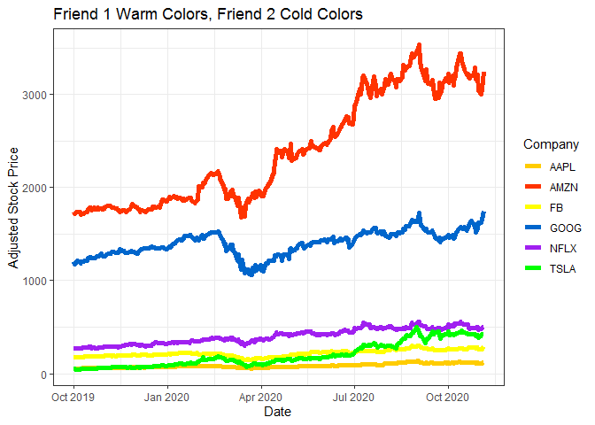

```r
library(tidyquant)
library(ggplot2)
library(tidyverse)
library(dplyr)
library(lubridate)

stocks<-tq_get(c("NFLX","AAPL", "AMZN", "GOOG","TSLA","FB"), get = "stock.prices", from = "2019-10-1")

ggplot(stocks)+
  geom_line(mapping = aes(x = date, y = close, color = symbol), size = 2)+
  scale_color_manual(values = c("#FFCC00","#FF3300","yellow","#0066CC","purple","green"))+
  labs(x = "Date",
       y = "Adjusted Stock Price",
       color = "Company",
       title = "Friend 1 Warm Colors, Friend 2 Cold Colors")+
  theme_bw()
```

<!-- -->


## Conclusion

I chose 6 random companies: Amazon, Facebook, Apple, Netflix, Google, and Tesla. I split them up into two teams, warm and cold, representing the friends. It's pretty clear that the warm friend is blowing away the cold friend singularly due to Amazon's incredible stock prices.
